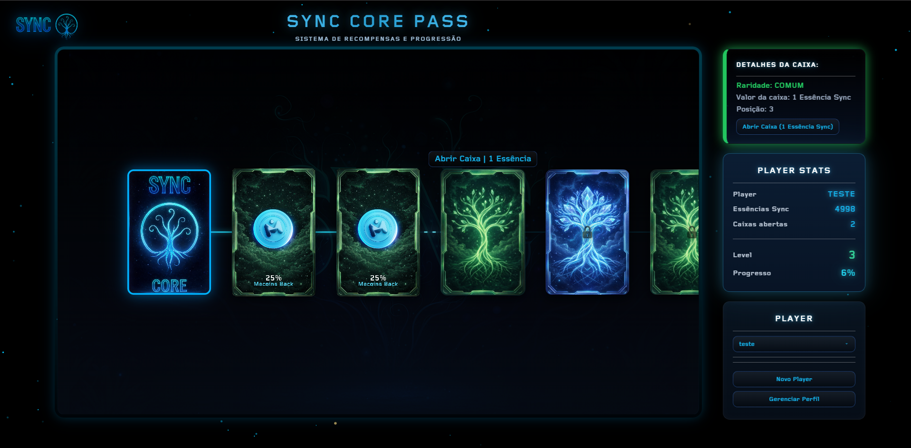

# Sync Core Pass

Aplicativo de progressão gamificada da Sync. O jogador utiliza **Essências Sync** para desbloquear nós de um passe, abrir caixas por raridade e receber recompensas por meio de uma roleta animada.

O projeto pode ser executado no navegador ou como aplicativo desktop com Electron. Os dados dos jogadores e o catálogo de recompensas são persistidos localmente em arquivos JSON.

<p align="center">
  
</p>

## Funcionalidades

- Criação, seleção, renomeação, reset e exclusão de jogadores.
- Administração de Essências Sync por jogador.
- Passe com desbloqueio sequencial de nós e custos por raridade.
- Caixas comuns, raras, épicas, lendárias e míticas.
- Roleta de recompensas com animações, imagens e efeitos sonoros.
- Reroll de caixas já abertas.
- Estatísticas de progresso e caixas abertas.
- Salvamento automático do progresso no backend local.
- Feedback visual para erros durante carregamento, salvamento e confirmações.

## Tecnologias

| Camada       | Tecnologia                            |
| ------------ | ------------------------------------- |
| Interface    | HTML, CSS e JavaScript com ES Modules |
| Backend      | Node.js e Express 5                   |
| Desktop      | Electron                              |
| Persistência | Arquivos JSON locais                  |
| Formatação   | Prettier 3.6.2                        |

## Pré-requisitos

- [Node.js](https://nodejs.org/) 18 ou mais recente.
- npm, instalado junto com o Node.js.

## Início rápido

Na raiz do projeto, instale as dependências:

```bash
npm install
```

Na primeira execução, crie o banco local a partir do exemplo:

```bash
cp database/DataBase.example.json database/DataBase.json
```

No PowerShell, use:

```powershell
Copy-Item database/DataBase.example.json database/DataBase.json
```

O arquivo `DataBase.json` contém saves gerados em runtime e, por isso, não é versionado.

### Aplicativo desktop

```bash
npm run dev
```

O Electron inicia o backend automaticamente e abre a aplicação em uma janela desktop.

### Navegador

```bash
npm start
```

Depois, acesse [http://localhost:3000](http://localhost:3000).

> Execute apenas um dos modos por vez. Ambos utilizam a porta `3000`.

## Como usar

1. Crie um jogador ou selecione um perfil existente.
2. Abra **Gerenciar Perfil** para adicionar, remover ou definir Essências Sync.
3. Selecione o próximo nó disponível no passe.
4. Confirme o custo para abrir a caixa.
5. Aguarde o resultado da roleta ou pressione `Esc` para pular a animação.

<p align="center">
  <video src="https://github.com/user-attachments/assets/04b31160-638d-4e82-a029-c9f6e3e9922c" controls width="600"></video>
</p>

6. Abra novamente uma caixa desbloqueada para realizar um reroll.

O progresso é salvo em `database/DataBase.json` após as ações que alteram o jogador.

## Scripts disponíveis

| Comando       | Descrição                                             |
| ------------- | ----------------------------------------------------- |
| `npm start`   | Inicia o servidor Express em `http://localhost:3000`. |
| `npm run dev` | Inicia o Electron e sobe o servidor automaticamente.  |

## Estrutura do projeto

```text
DevSync/
├── database/
│   ├── DataBase.example.json  # Modelo vazio para o banco local
│   ├── DataBase.json          # Saves locais (ignorado pelo Git)
│   └── Rewards.json           # Catálogo versionado de recompensas
├── electron/
│   └── main.js                # Processo principal do Electron
├── public/
│   ├── css/                   # Estilos da interface
│   ├── fonts/                 # Fonte utilizada pela interface
│   ├── images/
│   │   ├── branding/          # Logos e fundos institucionais
│   │   ├── rewards/           # Imagens das recompensas por raridade
│   │   └── *.png / favicon.ico # Nós, raridades e ícone da aplicação
│   ├── sounds/                # Efeitos sonoros e músicas
│   ├── js/
│   │   ├── admin/             # Controles administrativos
│   │   ├── api/               # Cliente HTTP do frontend
│   │   ├── audio/             # Inicialização e controle de áudio
│   │   ├── data/              # Configuração do passe e recompensas
│   │   ├── effects/           # Efeitos visuais
│   │   ├── nodes/             # Árvore, ações e fluxo de recompensas
│   │   ├── player/            # Estado, ações e telas do jogador
│   │   ├── roulette/          # Animação e resultado das caixas
│   │   ├── scene/             # Navegação e conexões da cena
│   │   ├── ui/                # Componentes compartilhados de interface
│   │   └── main.js            # Orquestração e composição dos módulos
│   └── index.html             # Entrada da interface
├── server.js                  # API e servidor de arquivos estáticos
└── package.json
```

## Arquitetura e fluxo de dados

O `public/js/main.js` funciona como ponto de composição. Ele obtém as referências do DOM, inicializa os módulos por domínio e conecta as dependências por meio de parâmetros nomeados.

O fluxo principal de uma recompensa é:

1. A interação com o nó solicita confirmação ao componente de modal.
2. `nodeRewardFlow.js` valida e desconta o custo.
3. A roleta seleciona e apresenta a recompensa.
4. O resultado é aplicado ao estado atual do jogador.
5. O frontend envia o estado atualizado ao backend.
6. A interface, as estatísticas e os nós são renderizados novamente.

Erros assíncronos propagam até os limites responsáveis pelo feedback visual. O modal de confirmação aguarda a ação, exibe falhas e sempre libera a interface ao terminar.

## Persistência

Cada jogador é armazenado em `database/DataBase.json`, criado localmente a partir de `database/DataBase.example.json`, com uma estrutura equivalente a:

```json
{
  "player1": {
    "points": 10,
    "unlockedNodes": ["root", "right_1"],
    "nodeRewards": {
      "right_1": "reward-id"
    }
  }
}
```

O servidor lê e reescreve `DataBase.json` diretamente. Esse arquivo é ignorado pelo Git para evitar que saves locais entrem no histórico do projeto. Não há banco de dados externo, autenticação ou controle de concorrência entre múltiplas instâncias.

## API local

| Método   | Rota               | Descrição                                 |
| -------- | ------------------ | ----------------------------------------- |
| `GET`    | `/players`         | Lista os IDs dos jogadores.               |
| `GET`    | `/player/:id`      | Retorna os dados de um jogador ou `null`. |
| `POST`   | `/player/:id/save` | Cria ou salva um jogador.                 |
| `DELETE` | `/player/:id`      | Exclui um jogador.                        |
| `GET`    | `/rewards`         | Retorna o catálogo de recompensas.        |
| `GET`    | `/reward/:id`      | Retorna uma recompensa pelo ID.           |

## Configuração do passe

Os principais pontos de customização são:

- `public/js/data/passConfig.js`: sequência de raridades, quantidade de nós, posição e espaçamento.
- `public/js/nodes/nodes.js`: custos e regras de desbloqueio.
- `database/Rewards.json`: catálogo de recompensas.
- `public/js/data/rewards.js`: dados de recompensa utilizados pela interface e pela roleta.
- `public/images/rewards/`: imagens organizadas por raridade.
- `public/js/data/sounds.js` e `public/sounds/`: configuração e arquivos de áudio.

Atualmente, a URL `http://localhost:3000` está definida em `server.js`, `electron/main.js` e `public/js/api/api.js`. Ao alterar a porta, atualize os três arquivos.

## Formatação e validação

Formate todo o projeto com:

```bash
npx --yes prettier@3.6.2 --write .
```

Confira a formatação sem alterar arquivos:

```bash
npx --yes prettier@3.6.2 --check .
```

O projeto ainda não possui uma suíte de testes automatizados. Ao modificar fluxos de jogador, persistência ou recompensas, valide manualmente os dois modos de execução.

## Contribuição

1. Faça uma alteração pequena e focada.
2. Preserve a separação por domínio e a injeção de dependências usada pelas funções `initX({...})` e `createX({...})`.
3. Evite adicionar estado global quando uma dependência puder ser passada explicitamente.
4. Rode o Prettier no projeto inteiro.
5. Teste o servidor no navegador e, quando relevante, a versão Electron.

## Licença

Distribuído sob a licença ISC. Consulte o arquivo [LICENSE](LICENSE).
